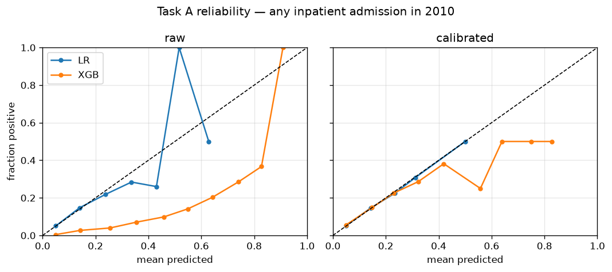

# claims-fm

**One pretrained claims encoder, two payer problems, honest baselines.**
A ~17M-parameter BERT-style encoder pretrained on 517k synthetic Medicare
claims histories (CMS DE-SynPUF, masked-code modeling), fine-tuned for
member next-year risk and provider fraud detection, benchmarked against
tuned XGBoost with the metrics a payer actually acts on. Total compute:
**$1.14** for v1.0; a pre-registered Phase 2 scaling study
([prereg](reports/scaling_prereg.md) · [results](reports/scaling_results.md))
added ~$5.50 of compute (and an honest ledger line for $7.90 of
idle-instance burn).

## Headline results (held-out test, single pass, 95% bootstrap CIs in reports)

| Task | Model | AUROC | AUPRC | Payer metric |
|---|---|---|---|---|
| Member risk — top-decile cost (prev 10.0%) | **XGBoost** (engineered features) | **0.762** | **0.303** | capture@5% outreach 20.5% |
| Member risk — top-decile cost | Pretrained transformer, fine-tuned | 0.715 | 0.246 | capture@5% outreach 17.0% |
| Provider fraud (prev 9.4%), 100% labels | **Hybrid: XGBoost + encoder embeddings** | **0.957** | **0.718** | precision@50 **82%** |
| Provider fraud, **25% of labels** | **Pretrained transformer** | 0.944¹ | **0.679** | vs XGBoost-alone 0.637 |
| Provider fraud, 25% of labels | XGBoost alone | — | 0.637 (±0.050) | 3–10× higher seed variance |

¹ AUROC at 100% labels; the 25%-label comparison is AUPRC (the money chart below).

<p>


</p>

**Left — the money chart:** with 10–25% of fraud labels (the regime real SIUs
live in), the pretrained encoder beats both its from-scratch twin and tuned
XGBoost, with 3–10× lower variance. **Right — calibration as a first-class
metric:** the tuned admission model's imbalance weighting wrecked its
probabilities (ECE 0.32); val-fit isotonic recalibration fixed them
(ECE 0.005) — payers consume probabilities, so this section exists.

## The five findings

1. **Tuned XGBoost wins member risk on synthetic data — and we measured why.**
   Not just observed: a hybrid XGBoost given the encoder's embeddings on top
   of engineered features scored *identically* to features-alone (0.763 vs
   0.762 AUROC). On DE-SynPUF, the sequence channel holds no signal the
   aggregates don't — the ceiling is the synthesis, not the method.
2. **Cross-dataset pretraining transfers.** From-scratch controls lose to the
   pretrained encoder at every label fraction on a fraud dataset the encoder
   never saw — the DE-SynPUF→Kaggle ICD-9 vocabulary bridge (99.9% dx
   coverage, gated before any GPU spend) did its job.
3. **Pretraining is label leverage.** At 25% of fraud labels the pretrained
   encoder (0.679 AUPRC) approaches XGBoost's full-label performance (0.711);
   the hybrid's best seed matches it outright. Confirmed fraud labels are the
   scarcest resource a payer has.
4. **The deployment answer is a ladder, not a winner.** Full labels → ship
   the simple model (LR hit 0.749 on fraud). Scarce labels → fine-tuned
   encoder (stability) or hybrid (peak precision@k). Member risk on real
   data → rerun the hybrid test first; it's the cheap experiment that says
   whether sequences carry signal your features miss.
5. **Scale doesn't fix it — measured, pre-registered.** A Phase 2 2×2 grid
   (17M→46M params × 517k→1.86M members) moved masked accuracy by less than
   half a point, left member risk exactly where it was, and made *low-label*
   fraud transfer worse. Removing the 512-token truncation (hierarchical
   MIL pooling over all claims) closed the fraud gap to 0.714 — but an
   untrained encoder with the same architecture also hit 0.714: at full
   labels, four model families converge on the same ~0.71 volume-signal
   ceiling. Predictions were frozen before training and three of five were
   refuted; the scorecard is the deliverable
   ([prereg](reports/scaling_prereg.md) → [results](reports/scaling_results.md)).

Full analysis: [technical writeup](reports/writeup.md) ·
[Task A report](reports/task_a_transformer.md) ·
[Task B report](reports/task_b_transformer.md) ·
[baselines](baselines/README.md) · [model card](MODEL_CARD.md) ·
[data documentation](DATA.md) · [pretraining report](reports/pretrain.md)

## Milestones & tags

| Tag | Milestone | Cost |
|---|---|---|
| — | M0–M1 scaffold, ETL, vocab, leakage tests, 99.9% overlap gate | $0 |
| `v0.2-baselines` | M2 LR + tuned XGBoost frozen **before any transformer work** | $0 |
| `v0.3-pretrained` | M3 masked-code pretraining, 12 epochs, 517k members | $0.52 |
| `v0.4-task-a` | M4 Task A fine-tune: probe / full / from-scratch | $0.32 |
| `v0.5-task-b` | M5 Task B transfer + label-efficiency grid (both arms) | $0.30 |
| `v1.0` | M5.5 hybrid experiment ($0, local) + M6 writeup | $0 |

**Budget ledger: $1.14 spent of $20** (RTX 4090 spot instances at
$0.25–0.29/hr; ledger includes all debugging and deliberate kill/resume
drills). Reserve unspent.

## Reproduce

```
make env         # uv-managed Python 3.12
make download    # DE-SynPUF samples 1–7, checksummed + integrity-verified
make m1          # tables → sequences → vocab → overlap gate → leakage tests
make m2          # cohorts, features, baselines (tuned on train/val, test once)
# M3–M5 GPU runs: ops/vast_runbook.md (provision → train → pull → destroy)
uv run pytest -q # 43 tests: ETL invariants, leakage rules, masking, resume determinism
```

Every run is config-driven (`configs/*.yaml`) and seeded; split assignments
are content-hashed and enforced by tests; the test set was touched once per
task. Data provenance, checksums, and the decision log live in
[DATA.md](DATA.md) and `configs/data.lock.yaml`.

Not built (by design): the stretch Streamlit demo — gated behind M6 in the
spec and cut in favor of the hybrid ablation, which changed the conclusions.
