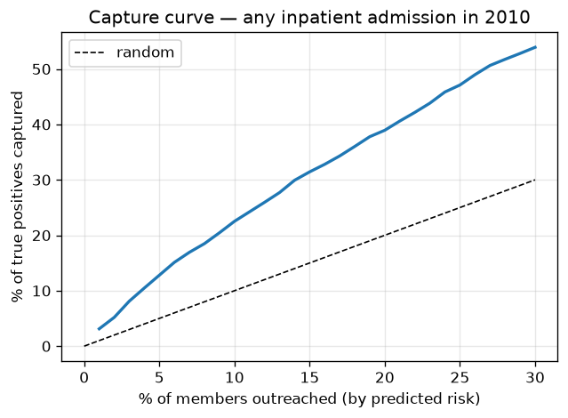
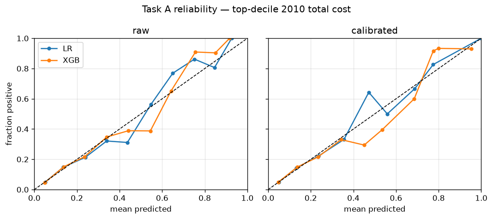
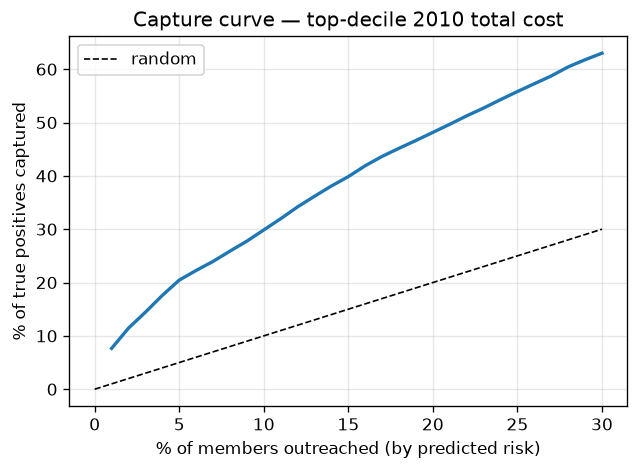

# Task A baselines — member next-year risk

Cohort, features, and protocol: see [README.md](README.md). Test set scored once;
95% CIs from member-level bootstrap. Calibrated = val-selected Platt/isotonic.

## any inpatient admission in 2010 (test prevalence 11.6%)

| Model | AUROC | AUPRC | Brier | ECE | Capture@1% | Capture@5% | Capture@10% |
|---|---|---|---|---|---|---|---|
| LR (calibrated) | 0.692 [0.681, 0.703] | 0.201 [0.189, 0.213] | 0.098 [0.094, 0.101] | 0.0034 | 2.3% [2.1%, 3.3%] | 11.3% [9.9%, 12.4%] | 20.4% [18.9%, 22.0%] |
| XGB (calibrated) | 0.710 [0.699, 0.721] | 0.218 [0.205, 0.232] | 0.097 [0.094, 0.100] | 0.0053 | 3.1% [2.4%, 3.6%] | 12.8% [11.5%, 13.9%] | 22.5% [20.8%, 24.2%] |

Uncalibrated XGB: Brier 0.2193, ECE 0.3225 → calibrated 0.0969 / 0.0053.

### Subgroup slices (XGB calibrated)

| Field | Group | n | Prevalence | Mean predicted | AUROC | ECE |
|---|---|---|---|---|---|---|
| sex | 1 | 7,468 | 11.4% | 11.3% | 0.721 | 0.0058 |
| sex | 2 | 9,639 | 11.7% | 11.6% | 0.702 | 0.0098 |
| race | 1 | 14,347 | 11.9% | 11.6% | 0.706 | 0.0056 |
| race | 2 | 1,691 | 9.6% | 11.0% | 0.712 | 0.0153 |
| race | 3 | 705 | 11.3% | 10.0% | 0.758 | 0.0194 |
| race | 5 | 364 | 9.3% | 10.0% | 0.755 | 0.0107 |
| age_band | 65-69 | 3,019 | 10.8% | 10.4% | 0.720 | 0.0079 |
| age_band | 70-74 | 3,374 | 10.4% | 10.9% | 0.708 | 0.0089 |
| age_band | 75-79 | 2,915 | 11.8% | 11.7% | 0.724 | 0.0069 |
| age_band | 80-84 | 2,455 | 12.7% | 12.3% | 0.699 | 0.0127 |
| age_band | 85-199 | 2,767 | 13.4% | 12.4% | 0.697 | 0.0127 |
| age_band | <65 | 2,577 | 10.9% | 11.4% | 0.706 | 0.0090 |

## top-decile 2010 total cost (test prevalence 10.0%)

| Model | AUROC | AUPRC | Brier | ECE | Capture@1% | Capture@5% | Capture@10% |
|---|---|---|---|---|---|---|---|
| LR (calibrated) | 0.743 [0.733, 0.754] | 0.269 [0.250, 0.289] | 0.082 [0.079, 0.085] | 0.0058 | 6.6% [5.8%, 7.4%] | 18.1% [16.6%, 19.5%] | 27.4% [25.9%, 29.4%] |
| XGB (calibrated) | 0.762 [0.751, 0.773] | 0.303 [0.283, 0.324] | 0.080 [0.077, 0.083] | 0.0066 | 7.7% [6.8%, 8.5%] | 20.5% [18.7%, 21.8%] | 29.9% [28.2%, 32.0%] |

Uncalibrated XGB: Brier 0.0796, ECE 0.0081 → calibrated 0.0796 / 0.0066.

### Subgroup slices (XGB calibrated)

| Field | Group | n | Prevalence | Mean predicted | AUROC | ECE |
|---|---|---|---|---|---|---|
| sex | 1 | 7,468 | 9.6% | 9.7% | 0.768 | 0.0076 |
| sex | 2 | 9,639 | 10.3% | 10.0% | 0.757 | 0.0082 |
| race | 1 | 14,347 | 10.2% | 10.0% | 0.755 | 0.0075 |
| race | 2 | 1,691 | 9.0% | 9.9% | 0.810 | 0.0127 |
| race | 3 | 705 | 9.6% | 8.1% | 0.794 | 0.0267 |
| race | 5 | 364 | 8.2% | 8.3% | 0.776 | 0.0057 |
| age_band | 65-69 | 3,019 | 8.7% | 8.5% | 0.777 | 0.0075 |
| age_band | 70-74 | 3,374 | 8.7% | 9.2% | 0.765 | 0.0091 |
| age_band | 75-79 | 2,915 | 10.8% | 10.1% | 0.772 | 0.0104 |
| age_band | 80-84 | 2,455 | 11.7% | 10.7% | 0.741 | 0.0128 |
| age_band | 85-199 | 2,767 | 11.6% | 11.3% | 0.756 | 0.0161 |
| age_band | <65 | 2,577 | 8.9% | 9.7% | 0.746 | 0.0099 |

Split integrity: `task_a_splits.parquet` sha256 = `0df64f85e7cf45b8…`; train-only cost threshold $8,350.
