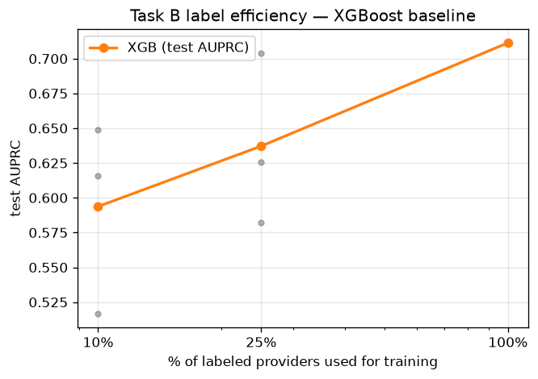

# Task B baselines — provider fraud detection

Provider-level splits; test = 812 providers, prevalence 9.4%. Test scored once;
95% CIs from provider-level bootstrap.

| Model | AUROC | AUPRC | P@50 | P@100 |
|---|---|---|---|---|
| LR | 0.961 [0.944, 0.974] | 0.749 [0.649, 0.829] | 78.0% [64.0%, 92.0%] | 59.0% [47.0%, 71.0%] |
| XGB | 0.952 [0.935, 0.967] | 0.711 [0.617, 0.796] | 76.0% [60.0%, 90.0%] | 54.0% [43.0%, 64.0%] |

**Operating point (XGB):** review the top 100 providers per period (~an SIU caseload) → precision 54.0%, recall 71.1%. Rationale: precision stays high enough that most referrals are actionable while capturing the bulk of flagged-provider fraud; adjust k to actual SIU capacity.

### Beneficiary overlap caveat (SPEC §5)

- 66.1% of beneficiaries appear under more than one provider.
- 79.3% of val-provider claims and 77.1% of test-provider claims involve a beneficiary also seen under some train provider. Splits are clean at the provider level (the unit of prediction), but member-level information is not fully disjoint — stated here rather than pretended away.

### Label efficiency (XGBoost at 10% / 25% / 100% of labeled providers)

| Fraction | Val AUPRC (mean over seeds) | Test AUPRC (mean) |
|---|---|---|
| 10% | 0.612 | 0.594 |
| 25% | 0.651 | 0.637 |
| 100% | 0.742 | 0.711 |

