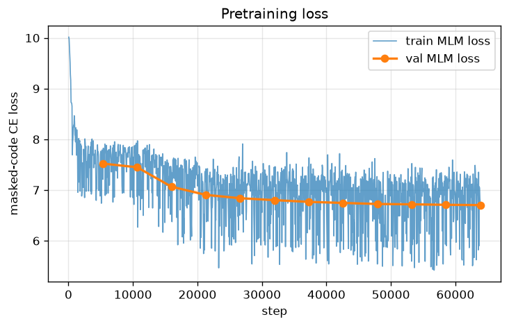
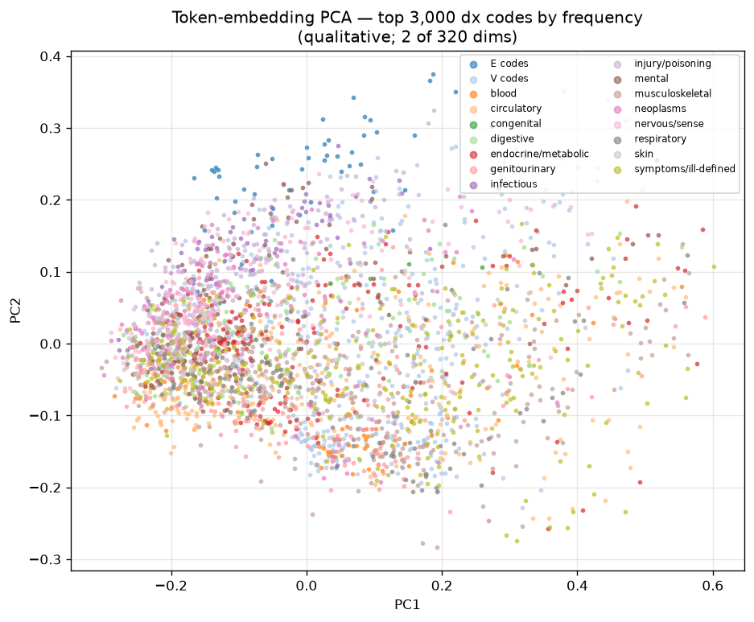

# Pretraining report (M3)

Encoder: 6L × d320, vocab 28,203, masked-code modeling on samples 3–7 (517,390 members; 2% member-level MLM validation holdout).

## Masked-code accuracy vs frequency prior

| Scope | Model top-1 | Frequency-prior top-1 |
|---|---|---|
| overall | 15.8% | 1.42% |
| dx | 21.6% | 4.51% |
| px | 26.4% | 3.41% |
| rx | 10.4% | 0.14% |

Final val MLM loss: 6.7031.
The frequency prior is the accuracy of always predicting the modal code
(per scope) — the SPEC acceptance bar is clearing it meaningfully.

## Embedding-space anchor probes (cosine nearest neighbors)

Code descriptions are display labels for common ICD-9 codes; judgment of
clinical coherence is qualitative by design (SPEC §6).

RX naming: FDA NDC directory matched 940 of the 15,000 RX tokens (DE-SynPUF randomizes NDCs in synthesis; unmatched neighbors shown raw).

**DX_25000 (diabetes II w/o complication)**

| Neighbor | Cosine |
|---|---|
| DX_2449 (hypothyroidism NOS) | 0.908 |
| DX_2720 (hypercholesterolemia) | 0.893 |
| DX_2724 (hyperlipidemia NEC) | 0.888 |
| DX_25002 (diabetes II uncontrolled) | 0.868 |
| DX_2859 (anemia NOS) | 0.853 |
| DX_25060 (diabetes w/ neuro manifestations) | 0.851 |
| DX_3051 (tobacco use disorder) | 0.845 |
| DX_25001 (diabetes I w/o complication) | 0.844 |

**DX_4280 (congestive heart failure)**

| Neighbor | Cosine |
|---|---|
| DX_42731 (atrial fibrillation) | 0.879 |
| DX_4439 (peripheral vascular disease) | 0.853 |
| DX_496 (COPD NOS) | 0.851 |
| DX_4299 (heart disease NOS) | 0.847 |
| DX_4293 (cardiomegaly) | 0.847 |
| DX_42789 (cardiac dysrhythmia NEC) | 0.847 |
| DX_41400 (coronary atherosclerosis) | 0.845 |
| DX_4292 (cardiovascular disease NOS) | 0.837 |

**DX_496 (COPD NOS)**

| Neighbor | Cosine |
|---|---|
| DX_49390 (asthma NOS) | 0.905 |
| DX_53081 (esophageal reflux) | 0.890 |
| DX_4439 (peripheral vascular disease) | 0.872 |
| DX_5119 (pleural effusion) | 0.866 |
| DX_4928 (obstructive chronic bronchitis) | 0.862 |
| DX_49320 (chronic obstr. asthma) | 0.861 |
| DX_4280 (congestive heart failure) | 0.851 |
| DX_4779 (allergic rhinitis) | 0.850 |

**DX_5859 (chronic kidney disease NOS)**

| Neighbor | Cosine |
|---|---|
| DX_5939 (kidney disorder NOS) | 0.894 |
| DX_5853 (CKD stage III) | 0.890 |
| DX_5854 (CKD stage IV) | 0.886 |
| DX_5856 (ESRD) | 0.884 |
| DX_60000 (benign prostatic hypertrophy) | 0.865 |
| DX_586 (renal failure NOS) | 0.855 |
| DX_5990 (urinary tract infection) | 0.851 |
| DX_5855 (CKD stage V) | 0.843 |

**DX_V5867 (long-term insulin use)**

| Neighbor | Cosine |
|---|---|
| DX_V5866 (long-term aspirin use) | 0.880 |
| DX_V5863 (long-term antiplatelets) | 0.860 |
| DX_V5865 (long-term steroids) | 0.830 |
| DX_V5862 (long-term antibiotics) | 0.829 |
| DX_V5869 | 0.827 |
| DX_V4581 (aortocoronary bypass status) | 0.805 |
| DX_V4582 (PTCA status) | 0.803 |
| DX_V4501 (cardiac pacemaker status) | 0.800 |

**PX_3995 (hemodialysis)**

| Neighbor | Cosine |
|---|---|
| PX_3893 (venous catheterization) | 0.816 |
| PX_3491 (thoracentesis) | 0.790 |
| PX_3895 (venous cath for renal dialysis) | 0.778 |
| PX_4513 (small bowel endoscopy) | 0.770 |
| PX_4525 (colonoscopy w/ biopsy) | 0.746 |
| PX_4516 (EGD w/ biopsy) | 0.744 |
| PX_3324 (closed lung biopsy) | 0.744 |
| PX_3950 (angioplasty NEC) | 0.741 |

## 2-D projection (qualitative)

PCA of the top 3,000 dx-code embeddings colored by ICD-9 chapter — two of
320 dimensions; treat as a sniff test, not evidence.
