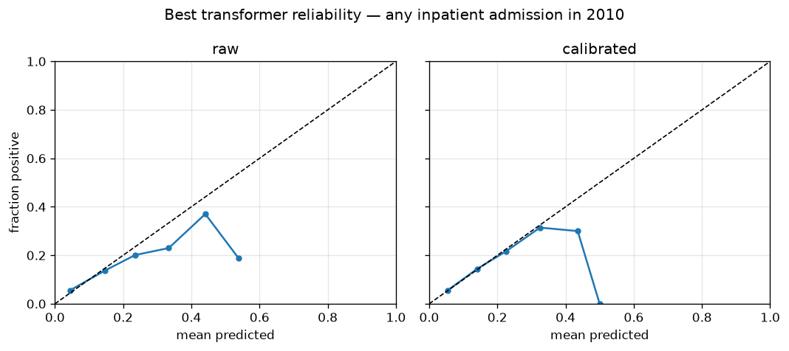
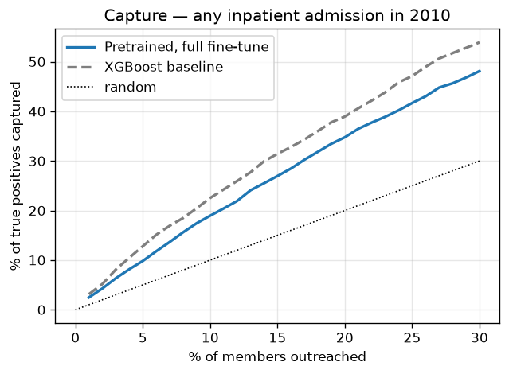
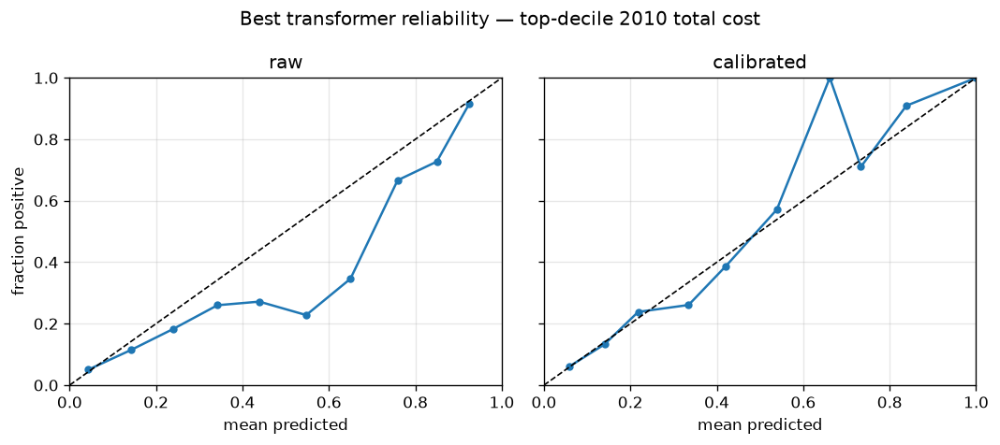
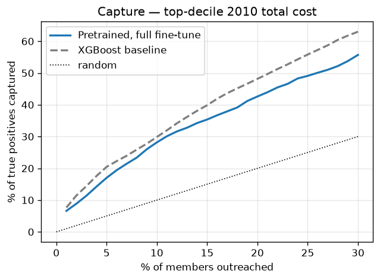

# Task A — transformer vs baselines (M4)

Same cohort, same committed splits, same observation-window inputs as the
frozen baselines (tag `v0.2-baselines`). Selection and calibration on val;
test scored once, here. 95% CIs: member-level bootstrap. Prediction head
reads the final-layer `[CLS]` state (design choice; no pooling search).

## any inpatient admission in 2010 (test prevalence 11.6%)

| Model | AUROC | AUPRC | Brier | ECE | Capture@1% | Capture@5% | Capture@10% |
|---|---|---|---|---|---|---|---|
| XGBoost (baseline) | 0.710 [0.699, 0.721] | 0.218 [0.205, 0.232] | 0.097 [0.094, 0.100] | 0.0053 | 3.1% [2.4%, 3.6%] | 12.8% [11.5%, 13.9%] | 22.5% [20.8%, 24.2%] |
| Logistic regression (baseline) | 0.692 [0.681, 0.703] | 0.201 [0.189, 0.213] | 0.098 [0.094, 0.101] | 0.0034 | 2.3% [2.1%, 3.3%] | 11.3% [9.9%, 12.4%] | 20.4% [18.9%, 22.0%] |
| Pretrained, frozen (linear probe) | 0.650 [0.639, 0.662] | 0.173 [0.163, 0.184] | 0.100 [0.096, 0.103] | 0.0048 | 2.4% [1.6%, 2.7%] | 9.4% [8.3%, 10.7%] | 16.8% [15.6%, 18.7%] |
| Pretrained, full fine-tune **←** | 0.669 [0.657, 0.680] | 0.184 [0.174, 0.197] | 0.099 [0.096, 0.103] | 0.0033 | 2.5% [1.9%, 3.1%] | 9.8% [8.8%, 11.2%] | 18.9% [17.4%, 20.6%] |
| From scratch (identical arch/budget) | 0.652 [0.641, 0.664] | 0.170 [0.161, 0.180] | 0.100 [0.096, 0.103] | 0.0026 | 1.7% [1.2%, 2.3%] | 8.6% [7.4%, 9.6%] | 16.7% [15.4%, 18.4%] |

Pretraining transfer: full fine-tune test AUPRC 0.184 vs from-scratch 0.170 (+0.015).
Best transformer (Pretrained, full fine-tune) AUROC 0.669 vs XGBoost 0.710; calibrated with isotonic (ECE 0.0033).

### Subgroup slices (best transformer, calibrated)

| Field | Group | n | Prevalence | Mean predicted | AUROC | ECE |
|---|---|---|---|---|---|---|
| sex | 1 | 7,468 | 11.4% | 11.4% | 0.664 | 0.0052 |
| sex | 2 | 9,639 | 11.7% | 11.6% | 0.672 | 0.0019 |
| race | 1 | 14,347 | 11.9% | 11.6% | 0.665 | 0.0052 |
| race | 2 | 1,691 | 9.6% | 11.2% | 0.689 | 0.0164 |
| race | 3 | 705 | 11.3% | 10.0% | 0.714 | 0.0131 |
| race | 5 | 364 | 9.3% | 10.3% | 0.618 | 0.0143 |
| age_band | 65-69 | 3,019 | 10.8% | 10.7% | 0.686 | 0.0014 |
| age_band | 70-74 | 3,374 | 10.4% | 11.1% | 0.658 | 0.0091 |
| age_band | 75-79 | 2,915 | 11.8% | 11.2% | 0.674 | 0.0075 |
| age_band | 80-84 | 2,455 | 12.7% | 11.8% | 0.669 | 0.0091 |
| age_band | 85-199 | 2,767 | 13.4% | 12.7% | 0.657 | 0.0111 |
| age_band | <65 | 2,577 | 10.9% | 11.7% | 0.658 | 0.0080 |

## top-decile 2010 total cost (test prevalence 10.0%)

| Model | AUROC | AUPRC | Brier | ECE | Capture@1% | Capture@5% | Capture@10% |
|---|---|---|---|---|---|---|---|
| XGBoost (baseline) | 0.762 [0.751, 0.773] | 0.303 [0.283, 0.324] | 0.080 [0.077, 0.083] | 0.0066 | 7.7% [6.8%, 8.5%] | 20.5% [18.7%, 21.8%] | 29.9% [28.2%, 32.0%] |
| Logistic regression (baseline) | 0.743 [0.733, 0.754] | 0.269 [0.250, 0.289] | 0.082 [0.079, 0.085] | 0.0058 | 6.6% [5.8%, 7.4%] | 18.1% [16.6%, 19.5%] | 27.4% [25.9%, 29.4%] |
| Pretrained, frozen (linear probe) | 0.704 [0.693, 0.717] | 0.226 [0.209, 0.243] | 0.084 [0.080, 0.087] | 0.0022 | 6.4% [5.5%, 7.1%] | 15.5% [14.2%, 17.1%] | 25.1% [23.1%, 26.8%] |
| Pretrained, full fine-tune **←** | 0.715 [0.703, 0.727] | 0.246 [0.228, 0.265] | 0.083 [0.079, 0.086] | 0.0057 | 6.6% [5.6%, 7.4%] | 17.0% [15.5%, 18.6%] | 28.2% [26.2%, 30.1%] |
| From scratch (identical arch/budget) | 0.696 [0.684, 0.708] | 0.217 [0.201, 0.235] | 0.084 [0.081, 0.088] | 0.0035 | 6.4% [5.4%, 7.1%] | 14.8% [13.4%, 16.4%] | 22.7% [21.3%, 24.9%] |

Pretraining transfer: full fine-tune test AUPRC 0.246 vs from-scratch 0.217 (+0.029).
Best transformer (Pretrained, full fine-tune) AUROC 0.715 vs XGBoost 0.762; calibrated with isotonic (ECE 0.0057).

### Subgroup slices (best transformer, calibrated)

| Field | Group | n | Prevalence | Mean predicted | AUROC | ECE |
|---|---|---|---|---|---|---|
| sex | 1 | 7,468 | 9.6% | 9.8% | 0.712 | 0.0102 |
| sex | 2 | 9,639 | 10.3% | 10.0% | 0.717 | 0.0040 |
| race | 1 | 14,347 | 10.2% | 10.0% | 0.708 | 0.0067 |
| race | 2 | 1,691 | 9.0% | 10.0% | 0.764 | 0.0105 |
| race | 3 | 705 | 9.6% | 8.6% | 0.756 | 0.0177 |
| race | 5 | 364 | 8.2% | 8.6% | 0.658 | 0.0340 |
| age_band | 65-69 | 3,019 | 8.7% | 8.8% | 0.724 | 0.0081 |
| age_band | 70-74 | 3,374 | 8.7% | 9.3% | 0.709 | 0.0067 |
| age_band | 75-79 | 2,915 | 10.8% | 10.0% | 0.715 | 0.0140 |
| age_band | 80-84 | 2,455 | 11.7% | 10.6% | 0.692 | 0.0151 |
| age_band | 85-199 | 2,767 | 11.6% | 11.4% | 0.722 | 0.0062 |
| age_band | <65 | 2,577 | 8.9% | 9.8% | 0.708 | 0.0167 |

## Reading

**Transformer vs XGBoost:** on this task, tuned XGBoost over engineered
aggregates beats every transformer variant (AUROC 0.710 vs 0.669 on
admissions, 0.762 vs 0.715 on cost, non-overlapping CIs) — and we ship the
GBM. That is the expected result on DE-SynPUF: the outcome-relevant signal
that survives synthesis (prior-year cost levels, coverage, chronic-flag
counts) is exactly what aggregate features capture, while the sequential
structure a transformer exploits is heavily weakened by the synthesis
process. With real claims, the sequence channel is where the headroom is;
here it is mostly noise.

**Did pretraining transfer? Yes.** At identical architecture and training
budget, the pretrained encoder beats its from-scratch twin on both labels
(AUPRC +0.015 admissions, +0.029 cost; the frozen linear probe alone matches
or beats from-scratch full fine-tuning). This is the mechanism the fraud
task (M5) stresses harder, where labeled data is scarce and transfer should
matter most.

**Equity note:** slices are broadly uniform, but the smallest group (race
code 5, n=364) shows the weakest discrimination and calibration for both
labels — same direction as the XGBoost baseline. Flagged for the writeup's
fairness discussion rather than smoothed over.

