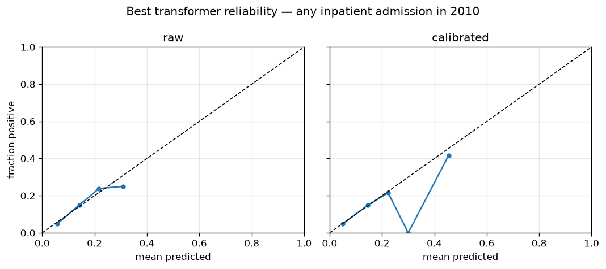
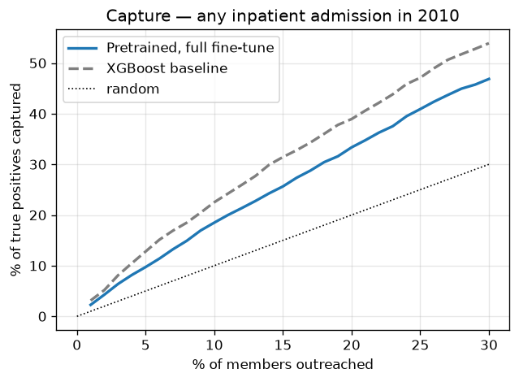
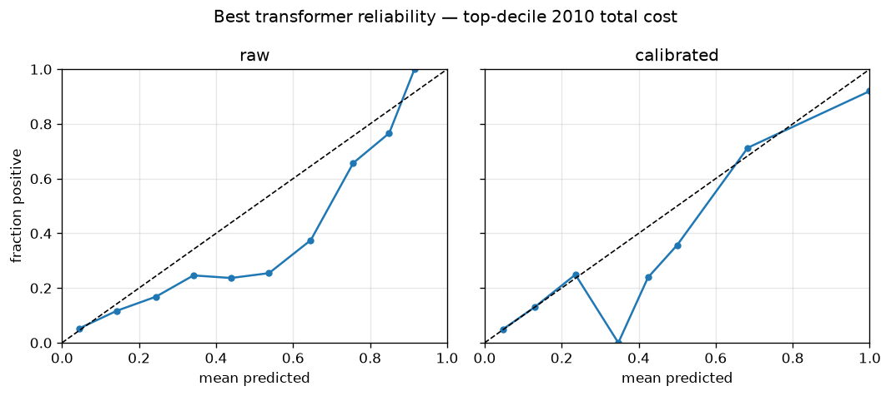
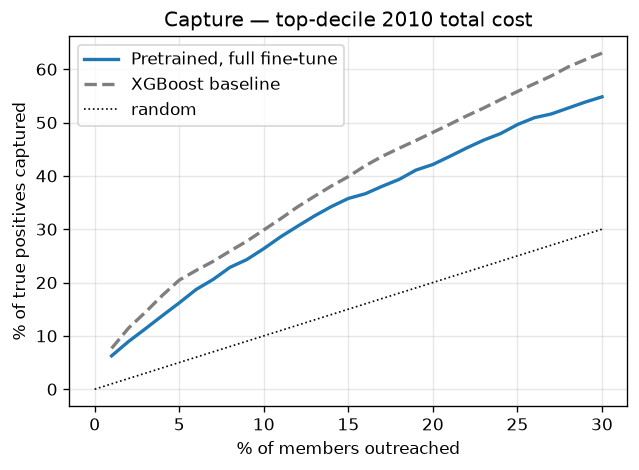

# Task A — transformer vs baselines (46m5s)

Same cohort, same committed splits, same observation-window inputs as the
frozen baselines (tag `v0.2-baselines`). Selection and calibration on val;
test scored once, here. 95% CIs: member-level bootstrap. Prediction head
reads the final-layer `[CLS]` state (design choice; no pooling search).

## any inpatient admission in 2010 (test prevalence 11.6%)

| Model | AUROC | AUPRC | Brier | ECE | Capture@1% | Capture@5% | Capture@10% |
|---|---|---|---|---|---|---|---|
| XGBoost (baseline) | 0.710 [0.699, 0.721] | 0.218 [0.205, 0.232] | 0.097 [0.094, 0.100] | 0.0053 | 3.1% [2.4%, 3.6%] | 12.8% [11.5%, 13.9%] | 22.5% [20.8%, 24.2%] |
| Logistic regression (baseline) | 0.692 [0.681, 0.703] | 0.201 [0.189, 0.213] | 0.098 [0.094, 0.101] | 0.0034 | 2.3% [2.1%, 3.3%] | 11.3% [9.9%, 12.4%] | 20.4% [18.9%, 22.0%] |
| Pretrained, full fine-tune **←** | 0.663 [0.652, 0.675] | 0.179 [0.168, 0.191] | 0.099 [0.096, 0.103] | 0.0030 | 2.3% [1.6%, 2.7%] | 9.7% [8.5%, 10.8%] | 18.5% [17.0%, 20.1%] |

Best transformer (Pretrained, full fine-tune) AUROC 0.663 vs XGBoost 0.710; calibrated with isotonic (ECE 0.0030).

### Subgroup slices (best transformer, calibrated)

| Field | Group | n | Prevalence | Mean predicted | AUROC | ECE |
|---|---|---|---|---|---|---|
| sex | 1 | 7,468 | 11.4% | 11.3% | 0.664 | 0.0038 |
| sex | 2 | 9,639 | 11.7% | 11.7% | 0.662 | 0.0024 |
| race | 1 | 14,347 | 11.9% | 11.6% | 0.659 | 0.0038 |
| race | 2 | 1,691 | 9.6% | 11.3% | 0.670 | 0.0175 |
| race | 3 | 705 | 11.3% | 10.4% | 0.731 | 0.0201 |
| race | 5 | 364 | 9.3% | 11.2% | 0.635 | 0.0251 |
| age_band | 65-69 | 3,019 | 10.8% | 10.8% | 0.687 | 0.0074 |
| age_band | 70-74 | 3,374 | 10.4% | 10.9% | 0.654 | 0.0078 |
| age_band | 75-79 | 2,915 | 11.8% | 11.3% | 0.677 | 0.0183 |
| age_band | 80-84 | 2,455 | 12.7% | 11.8% | 0.645 | 0.0089 |
| age_band | 85-199 | 2,767 | 13.4% | 12.8% | 0.651 | 0.0060 |
| age_band | <65 | 2,577 | 10.9% | 11.8% | 0.648 | 0.0103 |

## top-decile 2010 total cost (test prevalence 10.0%)

| Model | AUROC | AUPRC | Brier | ECE | Capture@1% | Capture@5% | Capture@10% |
|---|---|---|---|---|---|---|---|
| XGBoost (baseline) | 0.762 [0.751, 0.773] | 0.303 [0.283, 0.324] | 0.080 [0.077, 0.083] | 0.0066 | 7.7% [6.8%, 8.5%] | 20.5% [18.7%, 21.8%] | 29.9% [28.2%, 32.0%] |
| Logistic regression (baseline) | 0.743 [0.733, 0.754] | 0.269 [0.250, 0.289] | 0.082 [0.079, 0.085] | 0.0058 | 6.6% [5.8%, 7.4%] | 18.1% [16.6%, 19.5%] | 27.4% [25.9%, 29.4%] |
| Pretrained, full fine-tune **←** | 0.714 [0.702, 0.726] | 0.239 [0.221, 0.258] | 0.083 [0.080, 0.087] | 0.0028 | 6.3% [5.4%, 7.2%] | 16.2% [14.8%, 17.8%] | 26.4% [24.7%, 28.5%] |

Best transformer (Pretrained, full fine-tune) AUROC 0.714 vs XGBoost 0.762; calibrated with isotonic (ECE 0.0028).

### Subgroup slices (best transformer, calibrated)

| Field | Group | n | Prevalence | Mean predicted | AUROC | ECE |
|---|---|---|---|---|---|---|
| sex | 1 | 7,468 | 9.6% | 9.8% | 0.706 | 0.0068 |
| sex | 2 | 9,639 | 10.3% | 10.0% | 0.719 | 0.0046 |
| race | 1 | 14,347 | 10.2% | 10.0% | 0.706 | 0.0048 |
| race | 2 | 1,691 | 9.0% | 10.0% | 0.758 | 0.0126 |
| race | 3 | 705 | 9.6% | 8.6% | 0.769 | 0.0267 |
| race | 5 | 364 | 8.2% | 8.7% | 0.670 | 0.0183 |
| age_band | 65-69 | 3,019 | 8.7% | 8.7% | 0.722 | 0.0044 |
| age_band | 70-74 | 3,374 | 8.7% | 9.4% | 0.715 | 0.0065 |
| age_band | 75-79 | 2,915 | 10.8% | 10.0% | 0.718 | 0.0121 |
| age_band | 80-84 | 2,455 | 11.7% | 10.7% | 0.689 | 0.0118 |
| age_band | 85-199 | 2,767 | 11.6% | 11.4% | 0.720 | 0.0076 |
| age_band | <65 | 2,577 | 8.9% | 9.7% | 0.697 | 0.0098 |

