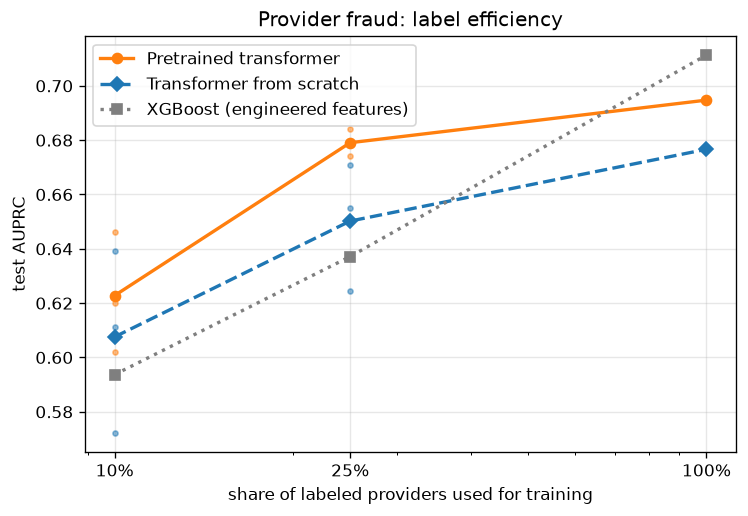

# Task B — cross-dataset transfer & label efficiency (M5)

Provider fraud on the Kaggle dataset, same committed provider splits as the
frozen baselines. Provider = one sequence of its claims (claim = `[VISIT]`
span of DX/PX codes) encoded by the DE-SynPUF-pretrained encoder; `[CLS]`
pooled. Selection/calibration on val; test scored once, here.

**Stated information asymmetry:** sequences truncate keep-most-recent at 512
tokens — 1,018 high-volume providers truncated; 47% of claims retained overall. The XGBoost baseline sees
all-claims aggregate features (including volume), so the baseline comparison
is not information-equal; the pretrained-vs-scratch comparison is (both arms
share the constraint).

## Headline comparison (test, prevalence 9.4%)

| Model | AUROC | AUPRC | P@50 | P@100 |
|---|---|---|---|---|
| XGBoost (baseline) | 0.952 [0.935, 0.967] | 0.711 [0.617, 0.796] | 76.0% [60.0%, 90.0%] | 54.0% [43.0%, 64.0%] |
| Logistic regression (baseline) | 0.961 [0.944, 0.974] | 0.749 [0.649, 0.829] | 78.0% [64.0%, 92.0%] | 59.0% [47.0%, 71.0%] |
| Pretrained, full fine-tune | 0.944 [0.923, 0.963] | 0.695 [0.594, 0.790] | 80.0% [62.0%, 90.0%] | 56.0% [44.0%, 66.0%] |
| From scratch | 0.941 [0.920, 0.960] | 0.677 [0.572, 0.772] | 78.0% [58.0%, 90.0%] | 52.0% [41.0%, 64.0%] |

Operating point (pretrained transformer, top 100): precision 56.0%, recall 73.7%.

## Label efficiency (test AUPRC; ± is std over subsample seeds)

| Labeled providers | XGBoost | Pretrained transformer | Transformer from scratch |
|---|---|---|---|
| 10% | 0.594 (±0.056) | 0.623 (±0.018) | 0.608 (±0.027) |
| 25% | 0.637 (±0.050) | 0.679 (±0.004) | 0.650 (±0.019) |
| 100% | 0.711 | 0.695 | 0.677 |

## Reading

**The transfer story holds where it matters.** Below full labels the ordering
is exactly the pretraining hypothesis: pretrained > from-scratch > XGBoost at
both 10% and 25% of labeled providers, with the pretrained encoder at 25%
(0.679) approaching what XGBoost needs the full label set to reach (0.711).
Real SIUs live in the label-scarce regime — confirmed fraud labels are
expensive — so this is the operationally relevant region of the chart.

**Stability is part of the result.** Across subsample seeds the pretrained
arm varies by ±0.004–0.018 AUPRC; XGBoost varies by ±0.050–0.056. With few
labels, the pretrained representation makes fraud detection not just better
but far more repeatable.

**At 100% labels, honest scoreboard:** XGBoost (0.711) and logistic
regression (0.749) still lead the transformer (0.695) on AUPRC with heavily
overlapping CIs — though the pretrained transformer posts the best P@50 (80%)
of any model. Given the stated information asymmetry (the transformer sees at
most 512 tokens of a provider's claims; the baselines see all-claims
aggregates including volume), we read the full-label comparison as parity,
not victory, and would ship the simpler model at full labels.

**Cross-dataset pretraining transferred.** The from-scratch control lags the
pretrained encoder at every fraction (e.g. −0.029 AUPRC at 25%), on a dataset
the encoder never saw during pretraining — the DE-SynPUF→Kaggle vocabulary
bridge (99.9% dx coverage, M1 gate) did its job.

