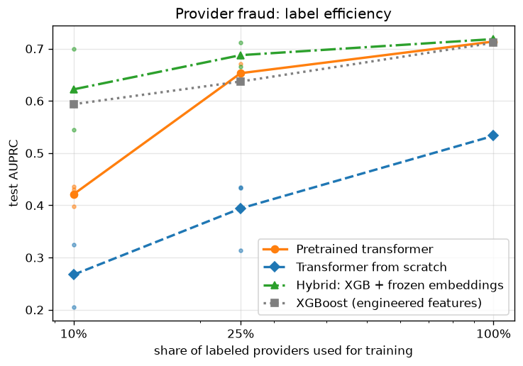

# Task B — cross-dataset transfer & label efficiency — hierarchical (Phase 2)

Provider fraud on the Kaggle dataset, same committed provider splits as the
frozen baselines. Hierarchical encoding (Phase 2): ALL of a provider's
claims in 512-token claim-aligned chunks, each encoded independently;
chunk `[CLS]` vectors pooled per provider with gated attention (MIL).
Selection on val; test scored once, here.

**No truncation:** 100% of claims retained (0 providers truncated). The v1.0
512-token information asymmetry vs the all-claims baselines is gone;
chunk count still implicitly encodes claim volume (as do the baselines'
volume features; the scratch arm shares the architecture).

## Headline comparison (test, prevalence 9.4%)

| Model | AUROC | AUPRC | P@50 | P@100 |
|---|---|---|---|---|
| XGBoost (baseline) | 0.952 [0.935, 0.967] | 0.711 [0.617, 0.796] | 76.0% [60.0%, 90.0%] | 54.0% [43.0%, 64.0%] |
| Logistic regression (baseline) | 0.961 [0.944, 0.974] | 0.749 [0.649, 0.829] | 78.0% [64.0%, 92.0%] | 59.0% [47.0%, 71.0%] |
| Pretrained, full fine-tune | 0.938 [0.913, 0.960] | 0.714 [0.620, 0.802] | 82.0% [66.0%, 92.0%] | 56.0% [43.0%, 68.0%] |
| From scratch | 0.915 [0.889, 0.939] | 0.533 [0.427, 0.647] | 58.0% [46.0%, 74.0%] | 46.0% [36.0%, 56.0%] |
| Probe (frozen encoder) | 0.913 [0.887, 0.938] | 0.539 [0.430, 0.654] | 60.0% [46.0%, 74.0%] | 46.0% [36.0%, 57.0%] |
| Hybrid: XGBoost + frozen embeddings (M5.5) | 0.957 [0.938, 0.973] | 0.718 [0.615, 0.822] | 82.0% [64.0%, 92.0%] | 58.0% [46.0%, 69.0%] |

Operating point (pretrained transformer, top 100): precision 56.0%, recall 73.7%.

## Label efficiency (test AUPRC; ± is std over subsample seeds)

| Labeled providers | XGBoost | Pretrained transformer | Transformer from scratch | Hybrid (XGB+emb) |
|---|---|---|---|---|
| 10% | 0.594 (±0.056) | 0.421 (±0.017) | 0.267 (±0.049) | 0.622 (±0.064) |
| 25% | 0.637 (±0.050) | 0.653 (±0.013) | 0.394 (±0.056) | 0.688 (±0.019) |
| 100% | 0.711 | 0.714 | 0.533 | 0.718 |

